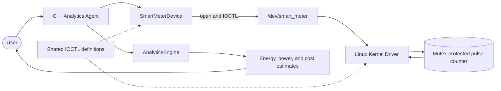
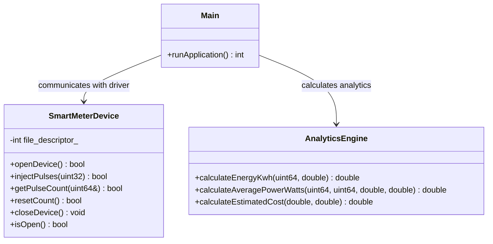
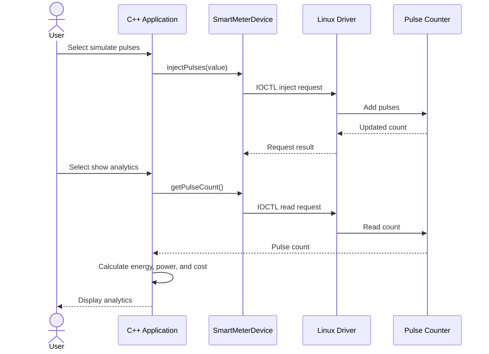

# ⚡ Smart Energy Smart-Meter Pulse Counter & Analytics Agent

**🌐 Domain:** IoT, Embedded Systems & Virtual Sensors  
**🖥️ Project Type:** Software-only Linux project  
**👤 Project Format:** Individual project

## 🔍 Project Overview

This project simulates a smart meter entirely in software. A virtual meter generates pulse events, and a Linux device driver passes those events to a C++ application. The application counts the pulses, estimates energy use and power, and displays useful analytics.

## 🎯 Project Goal

To build a Linux-based software system that demonstrates virtual meter pulses, device-driver communication, C++ programming, and energy analytics.

## 🧱 Project Boundary

This project uses software-generated meter pulses only. It does not require a physical meter, sensor, Arduino, or ESP32.

## 💻 Programming Languages

- **C++:** Main user-space application
- **C:** Linux kernel device driver

## 🗺️ Development Stages

1. Project Introduction
2. Requirements & Development Plan
3. System Design & Architecture
4. Initial Implementation & Prototype
5. Testing, Integration & Improvement
6. Final Implementation & Presentation

## System Architecture



## UML Class Diagram



## UML Sequence Diagram



## Build and Run on Ubuntu Linux

Build the kernel module and C++ application:

```bash
make
```

Load the driver and start the application:

```bash
sudo insmod driver/smart_meter_driver.ko
sudo ./smart_meter_agent
```

After exiting the application, unload the driver:

```bash
sudo rmmod smart_meter_driver
```

Run the C++ analytics unit tests:

```bash
make unit-test
```

The kernel module must be built and run in Linux with matching kernel headers. This project was developed in Ubuntu inside a UTM virtual machine.

## Limitations

- Pulse input is simulated; no physical meter or sensor is connected.
- Energy and cost are estimates based on the configured meter constant and sample tariff.
- Average power depends on the time between readings and may vary significantly for short intervals.
- Access to `/dev/smart_meter` currently requires administrator privileges.
