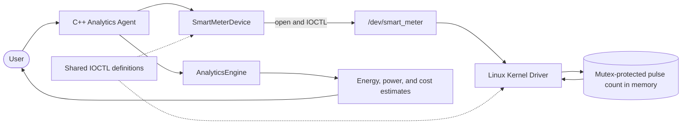

# ⚡ Smart Energy Smart-Meter Pulse Counter & Analytics Agent

**🌐 Domain:** IoT, Embedded Systems & Virtual Sensors

**🖥️ Project type:** Software-only Linux capstone

**💻 Languages:** C++17 user-space application and C Linux kernel module

**👤 Project format:** Individual project

## 🔎 Project Overview

This project is a software-only smart-meter prototype. The C++ application simulates meter pulses and communicates with a Linux kernel driver through `/dev/smart_meter`. The driver keeps a pulse count in memory while it is loaded. The application reads that count and calculates estimated energy, average power, and cost.

> **Scope:** Pulse input is simulated. No physical meter, sensor, Arduino, or ESP32 is connected. Results are educational estimates and are not intended for utility billing or production use.

## ✨ Implemented Features

- Simulate a chosen number of pulses through the C++ menu.
- Count, read, and reset pulses through a Linux miscellaneous character driver.
- Exchange requests between the application and driver using IOCTL operations.
- Protect the driver's shared pulse counter with a mutex.
- Calculate estimated energy, average power between readings, and sample cost.
- Validate menu and pulse input, with analytics unit tests for normal and edge cases.

### 🧠 What the project stores

The pulse count is held in the driver's memory while the kernel module is loaded. It is **not written to a log file or database**. Unloading the driver or restarting Linux clears the count. Persistent reading history and usage classification are possible future improvements; they are not implemented features in this version.

## 🏗️ System Architecture



## 📐 UML Diagrams

### Class Diagram


### Sequence Diagram

```mermaid
sequenceDiagram
    actor User
    participant App as C++ Application
    participant Device as SmartMeterDevice
    participant Driver as Linux Driver
    participant Counter as Pulse Counter
    User->>App: Select simulate pulses
    App->>Device: injectPulses(value)
    Device->>Driver: IOCTL inject request
    Driver->>Counter: Add pulses safely
    Driver-->>Device: Request result
    User->>App: Select show analytics
    App->>Device: getPulseCount()
    Device->>Driver: IOCTL read request
    Driver-->>App: Pulse count
    App->>App: Calculate energy, power, and cost
    App-->>User: Display estimates
```



## 🧮 Analytics and Three-Reading Example

The demonstration uses **1,000 pulses per kWh** and a sample tariff of **INR 8 per kWh**.

- **Energy (kWh) = cumulative pulse count ÷ pulses per kWh**
- **Estimated cost (INR) = energy (kWh) × tariff (INR/kWh)**
- **Average power (W) = energy change (kWh) × 3,600,000 ÷ elapsed seconds**

| Reading | Pulses added since previous step | Cumulative count | Energy | Estimated cost |
|---|---:|---:|---:|---:|
| 1 | 100 | 100 | 100 ÷ 1,000 = **0.100 kWh** | 0.100 × 8 = **INR 0.800** |
| 2 | 1 | 101 | 101 ÷ 1,000 = **0.101 kWh** | 0.101 × 8 = **INR 0.808** |
| 3 | 100 | 201 | 201 ÷ 1,000 = **0.201 kWh** | 0.201 × 8 = **INR 1.608** |

The first two readings match the recorded manual demonstration. Average power is omitted from this example because the program measures the actual time between readings, so that result changes from run to run.

## 🚀 Build and Run (Ubuntu Linux)

Run these steps **in the Ubuntu virtual machine terminal**, from the project directory. The kernel module must be built for the running Linux kernel and matching kernel headers.

### 1. Open the terminal and enter the project directory

```bash
cd ~/smart-meter-project
```

### 2. Build the driver and application

```bash
make
```

### 3. Load the smart-meter driver

```bash
sudo insmod driver/smart_meter_driver.ko
```

### 4. Start the application

```bash
sudo ./smart_meter_agent
```

At the menu, enter these choices and values to reproduce the three readings above:

```text
3          (reset the counter)
1, then 100 (simulate 100 pulses)
2          (show reading 1: 100 pulses, 0.100 kWh, INR 0.800)
1, then 1   (add one pulse)
2          (show reading 2: 101 pulses, 0.101 kWh, INR 0.808)
1, then 100 (add 100 pulses)
2          (show reading 3: 201 pulses, 0.201 kWh, INR 1.608)
4          (exit the application)
```

For example, the first analytics result is:

```text
Pulse count: 100
Estimated energy: 0.100 kWh
Sample tariff: INR 8.000 per kWh
Estimated cost: INR 0.800
Take another reading to estimate average power.
```

The next readings also print estimated average power since the prior reading. Its value depends on the elapsed time between those readings.

### 5. Unload the driver after exiting the app

```bash
sudo rmmod smart_meter_driver
```

This tells Linux to stop and remove the smart-meter kernel module after the application has closed the device. Its in-memory pulse count is cleared, and `/dev/smart_meter` is removed until the module is loaded again. This is normal cleanup; it does not remove your project files. The unit tests below do not use the driver, so it should stay unloaded while you run them.

### 6. Run the analytics unit tests

From the project directory, run:

```bash
make unit-test
```

The command compiles and runs the C++ analytics test program. Example output:

```text
PASS: 100 pulses at 1000 pulses/kWh = 0.1 kWh
PASS: zero pulses = 0 kWh
PASS: zero meter constant returns 0 kWh
PASS: 10 pulses over one hour = 10 W
PASS: zero elapsed time returns 0 W
PASS: decreasing pulse count returns 0 W
PASS: 0.1 kWh at INR 8/kWh = INR 0.8
PASS: negative energy returns INR 0
All analytics unit tests passed.
```

These tests cover energy, power, and cost calculations, including selected boundary inputs. They test the analytics functions only; they do not load or test the kernel driver.

## ✅ Verification Summary

- Kernel module and C++ application built successfully in Ubuntu Linux 24.04 ARM64 in UTM.
- Manual checks covered pulse simulation, analytics, reset, invalid input, exit, and unloading the driver.
- The recorded 100-pulse and 101-pulse results matched the configured meter constant and sample tariff.
- All eight analytics unit-test checks passed.

## ⚠️ Limitations

- Pulse input is simulated; no physical meter or sensor is connected.
- The pulse count exists only in driver memory while the module is loaded; it is not persistent.
- Energy and cost are estimates based on the configured meter constant and sample tariff.
- Average power can vary substantially when readings are taken very close together.
- Device access currently requires administrator privileges (`sudo`).
- Usage classification and historical file/database logging are not implemented.

## 🔭 Future Scope

- Add configurable meter constants and tariff rates.
- Add usage categories based on clearly documented energy thresholds.
- Save timestamped readings to a log or database with a separate C++ storage component.
- Produce summaries over a selected time period.
- Explore a physical pulse input only if hardware is added in a separately defined scope.

## 🗂️ Project Stages and Documentation

The capstone work is documented in six stages:

1. [Stage 1 – Project Introduction](docs/stage-1-project-introduction.md)
2. [Stage 2 – Requirements and Development Plan](docs/stage-2-project-requirements.md)
3. [Stage 3 – System Design and Architecture](docs/stage-3-system-design.md)
4. [Stage 4 – Initial Implementation and Prototype](docs/stage-4-initial-implementation.md)
5. [Stage 5 – Testing, Integration and Improvement](docs/stage-5-testing-and-improvement.md)
6. [Stage 6 – Final Project Report](docs/stage-6-final-report.md)

## 🎞️ Interactive 3D Project Presentation

Explore the project through an animated presentation covering the problem, Linux driver architecture, analytics, demonstration results, testing, and future scope.

🔗 [Launch the 3D Capstone Presentation](https://smrutiranjanbehera08.github.io/smart-energy-smart-meter-pulse-counter-analytics-agent/)

## 👨‍💻 Author

**Smrutiranjan Behera**

Wipro Capstone Project

*Smart Energy Smart-Meter Pulse Counter & Analytics Agent*
