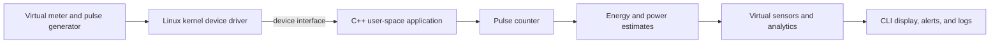

# ⚡ Stage 1 — Project Introduction

## 🏷️ Project Title

**Official project name:** Smart Energy Smart-Meter Pulse Counter & Analytics Agent  
**Technical title:** Linux-Based Virtual Smart Meter Device Driver and Energy Analytics Agent

## 🌐 Project Domain

IoT, Embedded Systems & Virtual Sensors

## 🖥️ Project Type

Individual, software-only Linux project. Meter pulses and sensor readings are simulated in software; no physical hardware is required.

## 📖 Background

Electricity meters can represent energy use as pulses. A meter constant defines how many pulses correspond to one kilowatt-hour (kWh). Counting those pulses makes it possible to estimate energy consumption and, using the time between pulses, estimate power.

This project models that process entirely in software. A virtual meter generates simulated pulse events. A Linux device driver provides a kernel-to-user-space interface, and a C++ application processes the events and presents energy analytics.

## ❓ Problem Statement

The project must demonstrate Linux device-driver concepts, system programming, and C++ development without requiring physical meter hardware. A software model is needed to generate repeatable meter events and show how Linux software can acquire, process, and analyze them.

## 💡 Motivation

- Learn how a Linux application communicates with a device driver.
- Practice C++ programming through a practical energy-monitoring example.
- Explore virtual sensors and event-based data processing.
- Make the project easy to demonstrate using repeatable simulated input.

## 🎯 Project Goal

Build a Linux-based virtual smart-meter system that processes simulated meter pulses and presents estimated energy usage and related analytics.

## ✅ Objectives

1. Generate virtual meter pulses using configurable simulated load patterns.
2. Provide a Linux device-driver interface for simulated meter events.
3. Read and process those events in a C++ user-space application.
4. Count pulses and calculate energy using a configurable meter constant.
5. Estimate power from the time between pulses.
6. Display virtual sensor readings and usage statistics.
7. Record readings and report configurable high-usage alerts.
8. Document and demonstrate the work through the instructor’s six project stages.

## 🛠️ Proposed Solution

The virtual meter generates timestamped pulses for low, normal, or high simulated loads. The Linux driver exposes meter data to the user-space application. The C++ application counts pulses, estimates energy and power, and sends the calculated readings to virtual sensor and analytics modules. A command-line interface displays the results, while the logger stores readings and alerts.

The exact driver interface and event format will be designed during Stage 3.

## 📦 Project Scope

### Included

- Software-generated smart-meter pulses.
- A Linux virtual device-driver component.
- A C++ user-space application.
- Pulse counting and configurable pulse-to-energy calculation.
- Estimated power, usage statistics, logging, and threshold alerts.
- Documentation, testing, version control, and project demonstrations.

### Excluded

- Physical electricity meters or sensors.
- Arduino, ESP32, or other hardware requirements.
- Measuring actual household electricity consumption.
- Utility billing or production-grade metering.

## 🏁 Expected Outcome

A working demonstration in which simulated meter pulses pass through a Linux device interface to a C++ application. The application will display pulse count, estimated energy, estimated power, and selected usage analytics. The final submission will include source code, documentation, test evidence, diagrams, and a presentation.

## 🏠 Applications

- Teaching Linux device-driver and user-space communication concepts.
- Demonstrating C++ system programming with simulated event data.
- Exploring how virtual sensor readings can feed energy analytics.
- Prototyping energy-monitoring calculations using repeatable software input.

This project is educational; it does not measure real electrical consumption.

## 🧰 Planned Technology Stack

- **Operating system:** Linux
- **Kernel driver:** C
- **User-space application:** C++
- **Build system:** Make or CMake, to be selected during Stage 3
- **Version control:** Git and GitHub
- **Development tools:** GCC/G++, Linux kernel headers, GDB, and Linux system-inspection tools

Linux kernel drivers are written in C. The main application will be written in C++.

## 🏗️ High-Level Architecture

## ⚠️ Limitations

- Pulses are simulated, so results cannot be verified against a physical meter.
- Power is estimated from simulated pulse timing and the configured meter constant.
- Cost estimates depend on a configured tariff and are not utility bills.
- Driver development requires a compatible Linux environment and kernel headers.
- This educational project is not intended for billing or production use.

## 🚀 Future Scope

Possible improvements include more simulated load profiles, configurable tariff schedules, historical reports, and additional analytics. Connecting physical devices would be a separate scope change; this project remains software-only.

## ➡️ Next Stage

Stage 2 will define the functional and non-functional requirements, project modules, features, deliverables, and development timeline.
