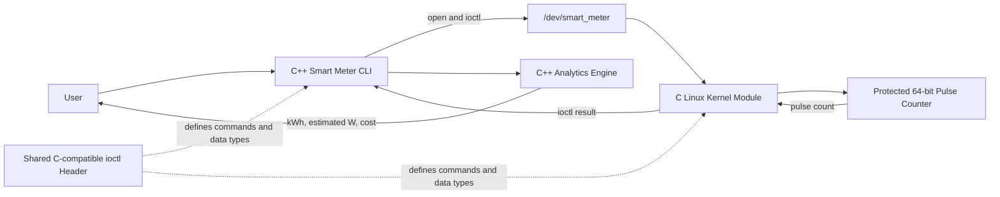
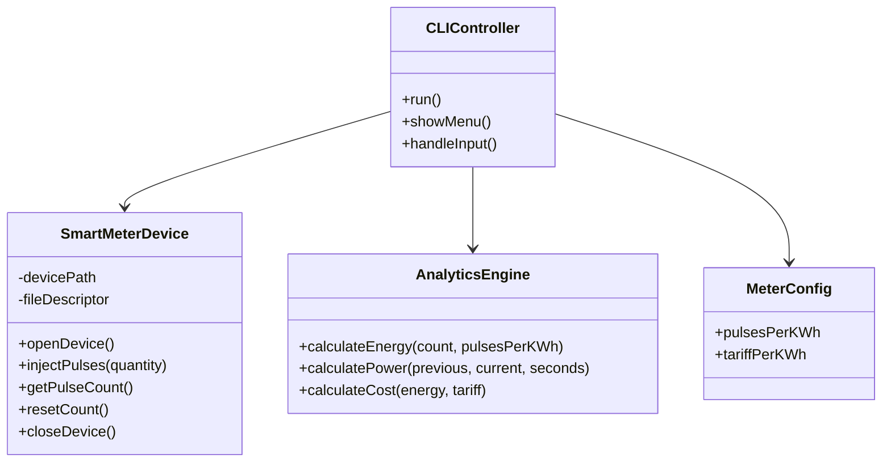
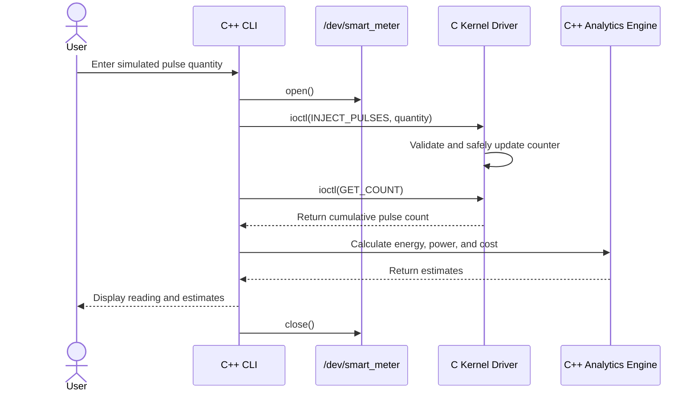
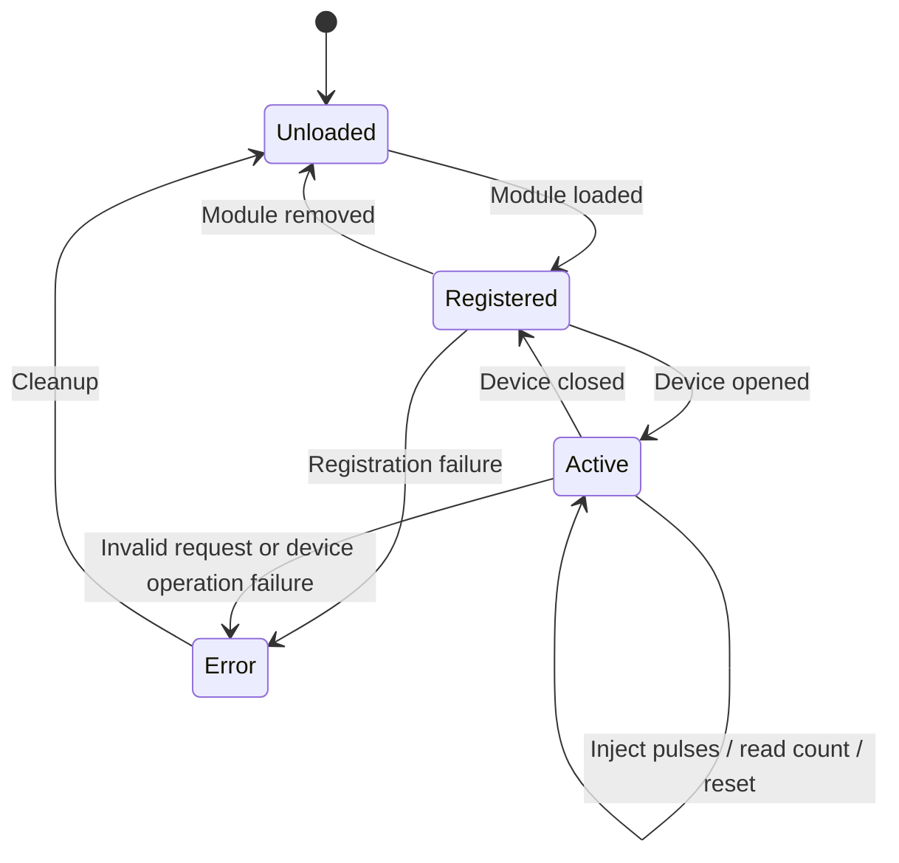

# 🏗️ Stage 3 – System Design & Architecture

## 🎯 Design Summary

The prototype has two main software parts:

1. A **Linux kernel module written in C** that provides a virtual smart-meter character device.
2. A **C++ command-line application** that sends simulated pulse counts to the device, reads the accumulated count, and calculates estimated energy, power, and cost.

The project will run and be built in the Ubuntu Linux virtual machine. It uses no physical meter or sensor.

## 🧱 System Architecture



### 🔁 Data Flow

1. The user enters a simulated pulse amount in the C++ command-line application.
2. The application opens `/dev/smart_meter`.
3. It sends an ioctl request to add the simulated pulses.
4. The driver validates the request and safely updates its counter.
5. The application requests the current cumulative pulse count.
6. The C++ analytics engine calculates and displays the estimates.

## 🧩 Main Components

| Component | Language | Responsibility |
|---|---|---|
| Virtual meter driver | C | Register `/dev/smart_meter`, validate ioctl requests, protect and update the pulse counter, return readings |
| Shared ioctl interface | C-compatible header | Define ioctl command numbers and fixed-width data structures used by the driver and application |
| Smart-meter command-line application | C++ | Accept user actions, communicate with the device, handle errors, and display readings |
| Analytics engine | C++ | Convert pulse counts and elapsed time into estimated energy, power, and cost |
| Build files | Makefile | Build the kernel module and C++ application on Linux |
| Documentation | Markdown | Explain design, setup, execution, and project progress |

## 🔌 Device Interface and Data Structures

The driver will use Linux’s **miscellaneous character device** framework and expose the device as `/dev/smart_meter`.

The shared header will define three ioctl operations:

- **INJECT_PULSES:** Accept a positive pulse quantity and add it to the counter.
- **GET_COUNT:** Return the current cumulative pulse count.
- **RESET_COUNT:** Set the counter to zero for a new demonstration.

Planned data types:

- `pulse_request`: a fixed-width unsigned 32-bit pulse quantity.
- `pulse_count`: a fixed-width unsigned 64-bit cumulative count.
- `meter_config`: pulses per kWh and sample tariff, stored by the C++ application.

The kernel driver will protect counter updates and reads with a mutex. The driver will reject invalid requests and return a suitable error code.

## 📐 Analytics Formulas

- **Energy (kWh)** = cumulative pulses ÷ pulses per kWh
- **Average power (W)** = change in energy (kWh) × 3,600,000 ÷ elapsed seconds
- **Estimated cost** = energy (kWh) × configured tariff per kWh

Initial demonstration configuration: **1000 pulses per kWh**. The tariff is a sample value entered or configured for demonstration only. These values are estimates, not utility measurements or billing values.

## 🧑‍💻 C++ Class Design



The kernel driver is written in C and is not represented as a C++ class. The application communicates with it through the shared ioctl interface.

## 🔄 Sequence Diagram



## 🚦 Driver State Machine



## 🗂️ Planned Repository Structure

```text
smart-meter-project/
├── app/
│   ├── main.cpp
│   ├── smart_meter_device.cpp
│   └── analytics_engine.cpp
├── driver/
│   ├── smart_meter_driver.c
│   └── Makefile
├── include/
│   └── smart_meter_ioctl.h
├── docs/
│   ├── stage-1-project-introduction.md
│   ├── stage-2-project-requirements.md
│   └── stage-3-system-design.md
├── Makefile
├── .gitignore
└── README.md
```

## 🛠️ Linux Development Environment

Development and execution will use **Ubuntu 24.04 ARM64** inside UTM on the MacBook Air M2.

Required Linux tools:

- GCC C compiler and G++ C++ compiler
- GNU Make
- Git
- Linux kernel headers matching the running Ubuntu kernel
- Standard Linux kernel module tools, including `make`, `insmod`, `rmmod`, and `dmesg`

Kernel-module loading and removal require administrator privileges. The C++ application will be run from the Ubuntu terminal.

## 🌿 Git Branching and Progress

- `main` is the stable branch used for the final GitHub submission.
- Create focused branches for substantial modules, such as `feature/kernel-driver` and `feature/cpp-analytics`.
- Commit small, understandable changes with messages describing the work.
- Merge a feature branch into `main` after reviewing the change.
- Push completed stage documentation and implementation to GitHub regularly.
- Keep progress evidence in the repository, such as diagrams, command output, and short demonstration notes.

## 🧭 Implementation Plan

1. Confirm Ubuntu compiler, Make, Git, and matching kernel headers.
2. Add the shared ioctl header and a minimal C kernel module.
3. Build and load the module; confirm `/dev/smart_meter` appears.
4. Add the C++ device wrapper and test pulse injection, reading, and reset.
5. Add energy, estimated power, tariff, input validation, and clear errors.
6. Document build and run instructions, then demonstrate the complete flow.

## ✅ Stage 3 Completion Checklist

- [ ] Architecture and data-flow diagram documented.
- [ ] Driver, interface, application, and analytics responsibilities defined.
- [ ] Class, sequence, and state diagrams documented.
- [ ] Device interface and data structures specified.
- [ ] Ubuntu tools and build environment identified.
- [ ] Repository layout, branching approach, and implementation plan recorded.
- [ ] Stage 3 document committed and pushed to GitHub.

## ➡️ Next Stage

**Stage 4 – Initial Implementation & Prototype:** prepare the Linux build tools and implement the first working version of the driver and C++ application.
